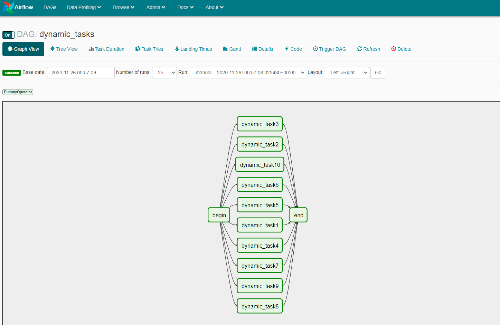

# AIRFLOW DYNAMIC TASKS

## Introdução
Este projeto tem como objetivo testar a funcionalidade de gerar tasks dinamicamente no Apache Airflow

## Pré-requisitos:
* [docker](https://www.docker.com/products/docker-desktop)

## Construção do ambiente através do docker compose:
   - Na pasta raiz do projeto, execute:
```
docker-compose up
```   
## Execução do pipeline:
   - Após a criação do ambiente, acesse o navegador através do endereço http://localhost:8080, ative o pipeline (ON) e clique no botão Trigger DAG:
